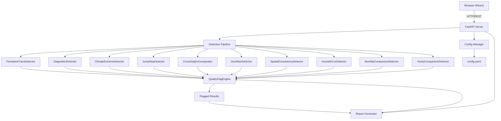

# 区域多站点雨量数据质量控制系统

Feature Name: rainfall-qc-system
Updated: 2026-06-26

## Description

基于规则引擎的区域多站点雨量数据质量控制系统。数据按站点目录组织（如 `RegionalStation西安/`），每个目录下存放该站全部数据表文件及 `station.yaml` 元数据。检测以站点为单位——选择目标站点后，系统加载同区域所有站点数据进行跨站比对，仅输出目标站点的异常结果。每个站点生成一个与目录同名的 Excel 报告（如 `RegionalStation西安.xlsx`），按表类型分 Sheet 输出。Web 界面完成站点目录管理、阈值配置、检测执行和报告下载。

## Architecture



## Project Structure

```
rainfall-qc-system/
├── server/
│   ├── main.py                 # FastAPI entry point
│   ├── api/
│   │   ├── __init__.py
│   │   ├── station.py          # Station directory CRUD
│   │   ├── upload.py           # Table file upload to station dir
│   │   ├── config.py           # Config read/write endpoints
│   │   ├── detection.py        # Detection trigger & results
│   │   └── report.py           # Report generation & export
│   ├── services/
│   │   ├── __init__.py
│   │   ├── parser.py           # CSV/Excel parser → DataFrame
│   │   ├── station_loader.py   # Scan data dir, load all station data
│   │   ├── detection/
│   │   │   ├── __init__.py
│   │   │   ├── base.py         # BaseDetector abstract class
│   │   │   ├── persistent_trace.py
│   │   │   ├── stagnation.py
│   │   │   ├── climate_extreme.py
│   │   │   ├── jump_step.py
│   │   │   ├── cross_station.py
│   │   │   ├── zero_rain.py
│   │   │   ├── spatial_consistency.py
│   │   │   ├── human_error.py
│   │   │   ├── monthly_comparison.py
│   │   │   └── yearly_comparison.py
│   │   ├── pipeline.py         # Orchestrates all detectors
│   │   ├── flag_engine.py      # Quality flag assignment
│   │   └── report.py           # Report generation logic
│   ├── models/
│   │   ├── __init__.py
│   │   ├── station.py          # Station metadata model
│   │   ├── rainfall.py         # Rainfall data models (excerpt, daily, monthly)
│   │   └── result.py           # Detection result / flag models
│   └── config/
│       ├── __init__.py
│       ├── manager.py          # Config load/save/reload
│       └── default.yaml        # Built-in default thresholds
├── client/
│   ├── src/
│   │   ├── App.tsx
│   │   ├── pages/
│   │   │   ├── UploadPage.tsx        # Data upload
│   │   │   ├── StationPage.tsx       # Station management
│   │   │   ├── ConfigPage.tsx        # Threshold configuration
│   │   │   ├── ReportPage.tsx        # Quality report view
│   │   │   └── ResultPage.tsx        # Flagged data detail
│   │   ├── components/
│   │   │   ├── FileUploader.tsx
│   │   │   ├── StationForm.tsx
│   │   │   ├── ConfigEditor.tsx
│   │   │   ├── FlagTable.tsx
│   │   │   └── SummaryChart.tsx
│   │   ├── api/
│   │   │   └── client.ts             # Axios/fetch wrapper
│   │   └── types/
│   │       └── index.ts              # TypeScript type definitions
│   ├── package.json
│   └── vite.config.ts
├── config.yaml                 # User-customized thresholds (optional)
└── requirements.txt
```

## Data Directory Structure

```
data/
├── RegionalStation西安/
│   ├── station.yaml              # 站点元数据
│   ├── 降雨摘录表.xlsx            # 或 .csv
│   ├── 逐日降水表.xlsx
│   ├── 月年降水对照表.xlsx
│   └── 各时段最大降水量表.xlsx
├── RegionalStation武汉/
│   ├── station.yaml
│   ├── 降雨摘录表.xlsx
│   ├── 逐日降水表.xlsx
│   └── 月年降水对照表.xlsx
└── ...
```

`station.yaml` 格式：

```yaml
name: 西安
longitude: 108.94
latitude: 34.26
elevation: 397.5
obs_type: auto          # manual | auto
```

检测时选择目标站点（如 `RegionalStation西安`），系统自动扫描同目录级下所有 `RegionalStation*/` 目录加载邻站数据，仅输出目标站点的检测结果。

## Data Models

### Station Metadata

| Field       | Type   | Description              |
|-------------|--------|--------------------------|
| id          | str    | 站点唯一标识              |
| name        | str    | 站点名称                  |
| longitude   | float  | 经度（十进制）             |
| latitude    | float  | 纬度（十进制）             |
| elevation   | float  | 高程（m）                 |
| obs_type    | enum   | 观测方式：manual / auto   |

### Rainfall Excerpt Record (降雨摘录表)

| Field       | Type          | Description      |
|-------------|---------------|------------------|
| station_id  | str           | 站点标识          |
| datetime    | datetime      | 时段起始时间       |
| precipitation | float        | 时段降雨量（mm）   |

### Daily Precipitation Record (逐日降水表)

| Field         | Type     | Description             |
|---------------|----------|-------------------------|
| station_id    | str      | 站点标识                 |
| date          | date     | 日期                     |
| precipitation | float    | 日降雨量（mm）            |
| is_snow       | bool     | 是否为降雪（对应原表 *）  |

### Max Period Rainfall Record (各时段最大降水量表)

| Field        | Type   | Description              |
|--------------|--------|--------------------------|
| station_id   | str    | 站点标识                  |
| period_type  | str    | 时段类型：1h/3h/6h/12h/24h |
| max_value    | float  | 该时段最大降水量（mm）     |

### Monthly Yearly Comparison Record (月年降水对照表)

| Field            | Type   | Description    |
|------------------|--------|----------------|
| station_id       | str    | 站点标识        |
| year             | int    | 年份            |
| month            | int    | 月份（年汇总时可为 null） |
| precipitation    | float  | 月/年降水量（mm）|
| precip_days      | int    | 降水日数         |

### Detection Result

| Field            | Type    | Description                     |
|------------------|---------|---------------------------------|
| id               | int     | 自增主键                         |
| report_id        | str     | 所属报告 ID                      |
| station_id       | str     | 站点标识                         |
| detector         | str     | 检测器名称                        |
| data_type        | str     | 数据表类型（excerpt/daily/monthly/period_max）|
| datetime         | datetime| 异常发生时间（时段/日期/月份）      |
| value            | float   | 实测值                           |
| expected_value   | float   | 期望值/参考值                     |
| deviation        | float   | 偏差量                           |
| trigger_rule     | str     | 触发规则描述                      |
| flag_level       | str     | 质量标记级别                       |
| detail           | str     | 补充说明                          |

### Report

| Field            | Type     | Description                     |
|------------------|----------|---------------------------------|
| id               | str      | 报告唯一 ID（UUID）               |
| station_name     | str      | 站点目录名（如 "RegionalStation西安"）|
| created_at       | datetime | 报告生成时间                      |
| total_flags      | int      | 异常总数                          |
| severe_count     | int      | 严重级数量                        |
| warning_count    | int      | 警告级数量                        |
| general_count    | int      | 一般级数量                        |
| info_count       | int      | 提示级数量                        |
| status           | str      | 状态：running / completed / failed |

### Excel 输出结构

每个站点检测结果输出为一个 `.xlsx` 文件，文件名与该站点目录名完全一致（如 `RegionalStation西安.xlsx`）。内含以下 Sheet：

| Sheet 名称           | 内容                                      | 出现条件                    |
|----------------------|------------------------------------------|---------------------------|
| 汇总统计              | 按检测器 × 标记级别交叉统计表              | 始终存在                    |
| 降雨摘录表            | excerpt 表检出的所有异常明细（仅目标站点）   | 有 excerpt 异常时出现        |
| 逐日降水表            | daily 表检出的所有异常明细（仅目标站点）     | 有 daily 异常时出现          |
| 月年降水对照表        | monthly 表检出的所有异常明细（仅目标站点）   | 有 monthly 异常时出现        |
| 各时段最大降水量      | period_max 表检出的所有异常明细（仅目标站点）| 有 period_max 异常时出现     |

每个明细 Sheet 列：时间 | 实测值 | 期望值 | 偏差 | 检测器 | 触发规则 | 标记级别 | 补充说明

## Components and Interfaces

### BaseDetector (Abstract Class)

```python
from abc import ABC, abstractmethod
from pandas import DataFrame


class BaseDetector(ABC):
    """所有检测器的基类，定义统一接口"""

    name: str                    # 检测器名称
    data_type: str               # 适用数据表类型

    @abstractmethod
    def detect(self, data: DataFrame, stations: list[dict], config: dict) -> list[DetectionResult]:
        """
        执行检测，返回异常结果列表。

        Args:
            data: 标准化后的降雨数据 DataFrame（含 station_id, datetime, precipitation 等列）
            stations: 站点元数据列表
            config: 当前生效的阈值配置字典

        Returns:
            检测到的异常结果列表
        """
        ...
```

### Detector Registry

所有检测器通过注册表统一管理，Pipeline 按序调用。

| 检测器                        | data_type   | 输入表                      |
|-------------------------------|-------------|-----------------------------|
| PersistentTraceDetector       | excerpt     | 降雨摘录表                   |
| StagnationDetector            | excerpt     | 降雨摘录表                   |
| ClimateExtremeDetector        | excerpt     | 降雨摘录表                   |
| JumpStepDetector              | excerpt     | 降雨摘录表                   |
| CrossStationComparator        | excerpt     | 降雨摘录表                   |
| PeriodMaxStagnationDetector   | period_max  | 各时段最大降水量表            |
| PeriodMaxCrossStationDetector | period_max  | 各时段最大降水量表            |
| ZeroRainDetector              | daily       | 逐日降水表                   |
| SpatialConsistencyDetector    | daily       | 逐日降水表                   |
| HumanErrorDetector            | daily       | 逐日降水表                   |
| MonthlyComparisonDetector     | monthly     | 月年降水对照表（按月）        |
| YearlyComparisonDetector      | monthly     | 月年降水对照表（按年）        |

### Detection Pipeline

系统以站点为单位执行检测，自动加载同区域邻站数据用于跨站比对：

```
Pipeline.detect(target_station_dir, data_dir, config) → Report

target_station_dir: 目标站点目录路径（如 "data/RegionalStation西安/"）
data_dir:           区域数据根目录（如 "data/"），系统自动扫描所有 RegionalStation*/ 子目录
```

Pipeline 流程：

1. 从 `target_station_dir/station.yaml` 读取目标站点元数据
2. 扫描 `data_dir` 下所有 `RegionalStation*/` 目录，加载各站全部数据表文件
3. 目标站点的所有数据表触发对应的单站时序检测器（持续性微量、僵直、极值、突跳、人为错误）
4. 所有站点数据共同触发跨站检测器（横向对比、零雨、空间一致性、月/年对照），仅写入目标站点触发的异常
5. 汇总所有检出结果，传入 QualityFlagEngine 分配标记级别
6. 生成 Report 对象和 `<目录名>.xlsx` 文件

检测报告独立存储，同一站点多次检测生成多份独立报告，互不覆盖。

### QualityFlagEngine

负责将检测器产出的 raw 结果统一分配标记级别。每个检测器的标记分级阈值内嵌在对应配置段中（如 jump_step.ratio_tiers、cross_station.std_tiers、spatial_consistency.q_tiers），QualityFlagEngine 读取对应配置完成映射。对于未定义分档的检测器（如 HumanErrorDetector），由检测器内部直接指定固定级别。

### API Endpoints

| Method   | Path                       | Description              |
|----------|----------------------------|--------------------------|
| GET      | /api/stations              | 获取区域下所有站点目录列表    |
| POST     | /api/stations              | 创建站点目录（含 station.yaml） |
| PUT      | /api/stations/{name}       | 更新站点元数据              |
| POST     | /api/stations/{name}/upload/{table_type} | 上传站点数据表文件 |
| GET      | /api/config                | 获取当前配置                |
| PUT      | /api/config                | 更新配置                    |
| POST     | /api/detect                | 对指定站点执行检测（body: `{"station": "RegionalStation西安"}`） |
| GET      | /api/results               | 获取检测结果（支持按 report_id、station、flag_level、detector 筛选） |
| GET      | /api/reports               | 获取历史检测报告列表 |
| GET      | /api/report/{id}/summary   | 获取指定报告的汇总统计 |
| GET      | /api/export/{report_id}    | 下载 Excel 报告（`站点目录名.xlsx`） |

### Configuration Schema (config.yaml)

```yaml
stations: []              # 站点元数据列表（也可通过 API 管理）

detection:
  persistent_trace:
    enabled: true
    window_hours: 12          # 滑动窗口大小（小时）
    low_values: [0.1, 0.2]    # 视为微量降雨的值
    effective_threshold: 0.5  # 有效降雨阈值

  stagnation:
    enabled: true
    duration_hours: 24        # 僵直持续时间阈值
    tolerance: 0.0            # 容许波动（mm）

  climate_extreme:
    enabled: true
    hourly_max: 150.0         # 时雨量上限（mm）
    daily_max: null           # 日雨量上限（按站点单独配置）
    percentile: 99.9          # 百分位数阈值
    station_limits:           # 分站点极值
      "ST001":
        daily_max: 300.0

  jump_step:
    enabled: true
    mad_window: 24            # MAD 滑动窗口大小（小时）
    mad_threshold: 5.0        # MAD 偏差倍数
    ratio_tiers:              # 突变倍率分档 → 告警级别（跳变值 / 前值）
      info: [2.0, 5.0]        # 2~5 倍 → 提示
      general: [5.0, 10.0]    # 5~10 倍 → 一般
      warning: [10.0, 30.0]   # 10~30 倍 → 警告
      severe: 30.0            # >30 倍 → 严重

  cross_station:
    enabled: true
    std_tiers:                # 标准差倍数分档 → 告警级别
      info: [2.0, 3.0]        # 2~3σ → 提示
      general: [3.0, 4.0]     # 3~4σ → 一般
      warning: [4.0, 5.0]     # 4~5σ → 警告
      severe: 5.0             # >5σ → 严重

  zero_rain:
    enabled: true
    micro_threshold: 0.2      # 视为无雨的微雨阈值
    pseudo_rain_max: 2.0      # 伪降雨判定上限

  spatial_consistency:
    enabled: true
    q_tiers:                  # Q 值分档 → 告警级别（Q = 本站 / 邻站均值）
      severe_low: 0.05        # Q < 0.05 → 严重偏小
      warning_low: 0.2        # Q < 0.2 → 警告偏小
      general_low: 0.5        # Q < 0.5 → 一般偏小
      info_low: 0.8           # Q < 0.8 → 提示偏小
      info_high: 3.0          # Q > 3.0 → 提示偏大
      general_high: 5.0       # Q > 5.0 → 一般偏大
      warning_high: 10.0      # Q > 10.0 → 警告偏大
      severe_high: 20.0       # Q > 20.0 → 严重偏大
    pseudo_rain_station_max: 5.0   # 判定为伪降雨时本站最大值
    snow_micro_threshold: 0.3      # 降雪微雨阈值

  human_error:
    enabled: true
    flood_months: [5, 6, 7, 8, 9, 10]   # 汛期月份

  monthly_comparison:
    enabled: true
    non_flood_ratio_max: 2.0       # 非汛期最大倍数比
    flood_ratio_max: 5.0           # 汛期最大倍数比
    flood_months: [5, 6, 7, 8, 9, 10]

  yearly_comparison:
    enabled: true
    precip_ratio_max: 2.0          # 年降水量最大倍数比
    days_ratio_max: 2.0            # 年降水日数最大倍数比
```

## Detection Algorithms Detail

### 1. PersistentTraceDetector (持续性微量降雨)

```
Input: 按站分组的小时雨量序列
Algorithm:
  for each station:
    for each sliding window of size N:
      values = window values
      if all values in [0.1, 0.2] and count(values) >= N:
        if no value in window > 0.5:
          flag entire window as "持续性微量降雨"
Output: [DetectionResult] with station_id, start_time, end_time, duration, max_value
```

### 2. StagnationDetector (僵直值)

```
Input: 按站分组的小时雨量序列
Algorithm:
  for each station:
    find consecutive segments where abs(value - first_value) <= tolerance
    for each segment with length >= H hours:
      if segment values are all > 0 (non-zero):
        flag segment as "僵直值"
Output: [DetectionResult] with station_id, start_time, end_time, stagnant_value
```

### 3. ClimateExtremeDetector (气候极值)

```
Input: 按站分组的小时雨量序列
Algorithm:
  for each station:
    get station-specific daily_max from config
    if hourly_max configured and value > hourly_max → flag
    if daily_max configured:
      compute daily sums, flag days where sum > daily_max
    compute P99.9 of historical values
    flag values > P99.9
Output: [DetectionResult] with station_id, datetime, value, threshold_exceeded
```

### 4. JumpStepDetector (突跳/阶跃)

```
Input: 按站分组的小时雨量序列
Algorithm:
  for each station:
    MAD method:
      for each sliding window of size W:
        median = median(window)
        mad = 1.4826 * median(|values - median|)  # scaled MAD
        for each value in window:
          if |value - median| / mad > N → flag as "MAD 离群"

    Step (change rate) method:
      for each adjacent pair (prev, curr):
        if prev > 0:
          ratio = curr / prev
          if curr > 0 and ratio >= ratio_tiers.info[0]:
            determine flag level by matching ratio against tiers:
              ratio in [2,5)   → Info
              ratio in [5,10)  → General
              ratio in [10,30) → Warning
              ratio >= 30      → Severe
            if next value after curr is near 0:
              record as "阶跃" (spike then immediate zero)
Output: [DetectionResult] with station_id, datetime, prev_value, curr_value, ratio, flag_level
```

### 5. CrossStationComparator (跨站横向对比)

```
Input: 按时间段分组的多站雨量数据
Algorithm:
  for each time period:
    group precipitations by station
    compute mean and std across all stations for this period
    for each station:
      z_score = |value - mean| / std (if std > 0)
      match z_score against std_tiers:
        z_score in [2,3)   → Info
        z_score in [3,4)   → General
        z_score in [4,5)   → Warning
        z_score >= 5       → Severe
Output: [DetectionResult] with station_id, datetime, value, regional_mean, z_score, flag_level
```

### 6. ZeroRainDetector (邻近站点零雨)

```
Input: 按日分组的多站日雨量数据
Algorithm:
  for each day:
    for each station i where precipitation_i > 0:
      get other stations j where station_i != station_j
      check if all other stations have precipitation_j < micro_threshold
      if so AND precipitation_i < pseudo_rain_max:
        flag station_i as "疑似伪降雨"
      if snow day, use snow_micro_threshold instead
Output: [DetectionResult] with station_id, date, value, neighbor_max
```

### 7. SpatialConsistencyDetector (空间一致性比率)

```
Input: 按日分组的多站日雨量数据
Algorithm:
  for each day:
    for each station:
      neighbor_mean = mean(precipitation of all other stations)
      if neighbor_mean > 0:
        Q = station_precipitation / neighbor_mean
        match Q against q_tiers:
          Q < severe_low        → Severe  (严重偏小)
          Q < warning_low       → Warning (警告偏小)
          Q < general_low       → General (一般偏小)
          Q < info_low          → Info    (提示偏小)
          Q > severe_high       → Severe  (严重偏大)
          Q > warning_high      → Warning (警告偏大)
          Q > general_high      → General (一般偏大)
          Q > info_high         → Info    (提示偏大)
        // 补充判定：Q 偏大时结合本站绝对值区分伪雨/局地强对流
        if Q > info_high AND station_precip < pseudo_rain_station_max:
          detail += " 疑似伪雨（树叶干扰）"
        elif Q > info_high AND station_precip >= pseudo_rain_station_max:
          detail += " 可能局地强对流，建议结合雷达复核"
Output: [DetectionResult] with station_id, date, value, neighbor_mean, Q_value, flag_level
```

### 8. HumanErrorDetector (人为错误)

```
Input: 按站分组的日雨量数据 + 站点 obs_type + 当前日期
Algorithm:
  for each station:
    determine if current month is in flood_months
    filter days where precipitation > 0
    if not flood_season AND obs_type == "manual":
      check if ALL precipitation values are even → flag
    if flood_season AND obs_type == "auto":
      check if ANY precipitation value is odd → flag
Output: [DetectionResult] with station_id, flag_reason
```

### 9. MonthlyComparisonDetector (月降水对照)

```
Input: 按月分组的多站月降水数据
Algorithm:
  for each month (year-month):
    determine if flood season based on month
    group station monthly precipitation
    compute min, max, mean across stations
    ratio = max / min (excluding zero-min)
    if not flood_season AND ratio > non_flood_ratio_max:
      flag stations with extreme values
    if flood_season AND ratio > flood_ratio_max:
      flag stations with extreme values
Output: [DetectionResult] with station_id, year, month, value, regional_stats
```

### 10. YearlyComparisonDetector (年降水与降水日数联合)

```
Input: 按年汇总的多站年降水 & 年降水日数
Algorithm:
  for each year:
    compute precip_ratio = max_precip / min_precip (across stations)
    compute days_ratio = max_days / min_days (across stations)
    if precip_ratio > precip_ratio_max AND days_ratio > days_ratio_max:
      flag as Info (提示) — both dimensions abnormal
    elif precip_ratio > precip_ratio_max XOR days_ratio > days_ratio_max:
      flag as Warning (警告) — only one dimension abnormal
Output: [DetectionResult] with station_id, year, precip, days, ratios
```

## Correctness Properties

1. **幂等性**：同一份数据多次检测输出结果完全一致
2. **可追溯性**：每条异常标记可追溯到触发规则和具体阈值
3. **阈值隔离**：修改一项检查的阈值不影响其他检查的结果
4. **空数据安全**：输入为空时返回空结果列表，不抛出异常
5. **数据类型匹配**：检测器仅处理其声明的 data_type，跨类型不执行

## Error Handling

| 场景                        | 处理策略                                       |
|-----------------------------|-----------------------------------------------|
| 上传文件格式不正确           | 返回 400 + 具体错误信息（期望列名 vs 实际列名）  |
| 上传文件包含空值             | 跳过空值行，在结果中标注跳过的行数               |
| 站点元数据缺失               | 使用默认值（lon=0, lat=0）并记录警告日志         |
| 某检测器执行异常             | 捕获异常，记录日志，跳过该检测器继续执行后续检测  |
| 配置文件格式错误             | 回退到内置默认值，返回 200 并附带警告信息        |
| 站点数为 1（无法做跨站比对）  | 跨站检测器自动跳过，返回空结果                   |
| 百分位数计算时数据量不足     | 数据量 < 100 时跳过 P99.9 检查，仅用绝对值阈值   |

## Test Strategy

| 层级         | 范围                              | 工具            |
|-------------|-----------------------------------|-----------------|
| 单元测试     | 每个 Detector 的核心算法逻辑       | pytest           |
| 集成测试     | Pipeline + FlagEngine 完整流程     | pytest + fixtures |
| API 测试     | FastAPI 端点请求/响应              | httpx / TestClient |
| 前端测试     | 组件渲染与交互                     | vitest + React Testing Library |
| 端到端测试   | 上传 → 检测 → 查看结果全流程       | Playwright       |

### 关键测试用例

| 测试场景                                    | 预期结果                              |
|---------------------------------------------|--------------------------------------|
| 连续 12 小时 0.1mm 数据 → PersistentTrace    | 标记整段为持续性微量降雨                |
| 连续 24 小时恒定 0.5mm → Stagnation          | 标记整段为僵直值                       |
| 时雨量 200mm（阈值 150）→ ClimateExtreme     | 标记超气候极值                         |
| 正常站点 + 一个全零站点同天 → ZeroRain       | 标记为零雨异常                         |
| 1→5 跳变（ratio=5）→ JumpStep                    | 标记为一般                             |
| 1→25 跳变（ratio=25）→ JumpStep                  | 标记为警告                             |
| Q=0.03（邻站均 50mm，本站 1.5mm）→ Spatial       | 标记为严重偏小                          |
| Q=15（邻站均 2mm，本站 30mm）→ Spatial           | 标记为警告偏大                          |
| 非汛期人工站全为偶数 → HumanError                | 标记为疑似人工取偶                      |
| 仅目标站异常，邻站正常 → 跨站检测器                  | 仅目标站写入结果，邻站不写入              |
| 检测 `RegionalStation西安` → 输出文件              | `RegionalStation西安.xlsx`             |
| 两次检测同一站点 → 两份独立 report_id               | 报告互不覆盖                            |
| 原始数据文件在检测后未被修改                         | 原文件内容不变                          |
| 空 DataFrame → Pipeline.detect()            | 返回空列表，不抛异常                    |
| 配置文件缺失 → ConfigManager                | 使用内置默认值，返回警告                 |

## Technology Stack

| 层级       | 技术                                          |
|-----------|-----------------------------------------------|
| 后端       | Python 3.10+, FastAPI, pandas, numpy, scipy    |
| 前端       | React 18, TypeScript, Vite, Ant Design 5       |
| 配置管理   | PyYAML                                        |
| 数据解析   | pandas (read_csv, read_excel)                  |
| 统计计算   | scipy.stats (percentile), numpy (median, std)  |
| 可选空间   | pykrige (克里金), scipy.spatial (IDW)          |
| 开发工具   | pytest, ruff (lint), mypy (type check)         |

## References

[^1]: (GHCN-Daily) - NOAA NCEI GHCN-Daily Quality Control: https://www.ncei.noaa.gov/products/land-based-station/global-historical-climatology-network-daily
[^2]: (TADA) - USGS Tool for Automated Data Assimilation: https://github.com/DOI-USGS/TADA
[^3]: (climatol) - R package for climate series homogenization: https://CRAN.R-project.org/package=climatol
[^4]: (pykrige) - Kriging Toolkit for Python: https://github.com/GeoStat-Framework/PyKrige
